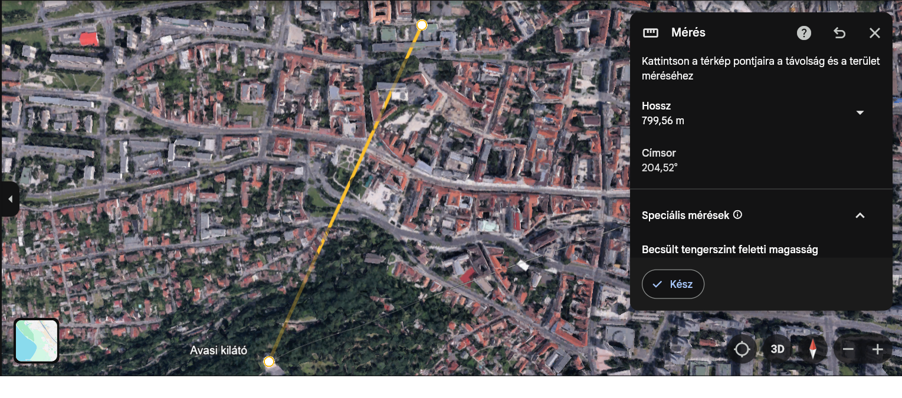
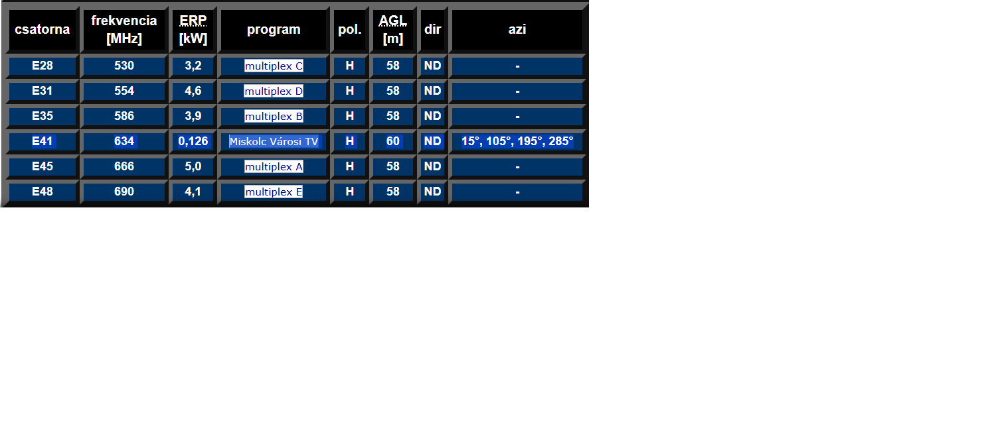
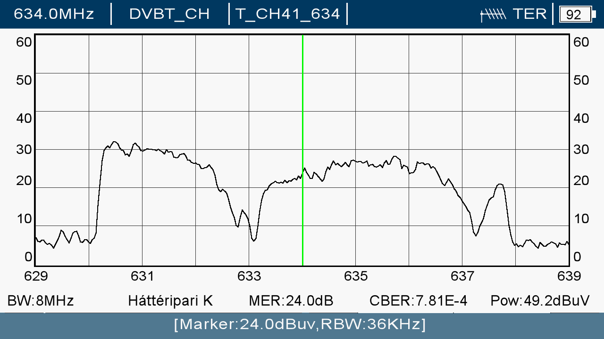
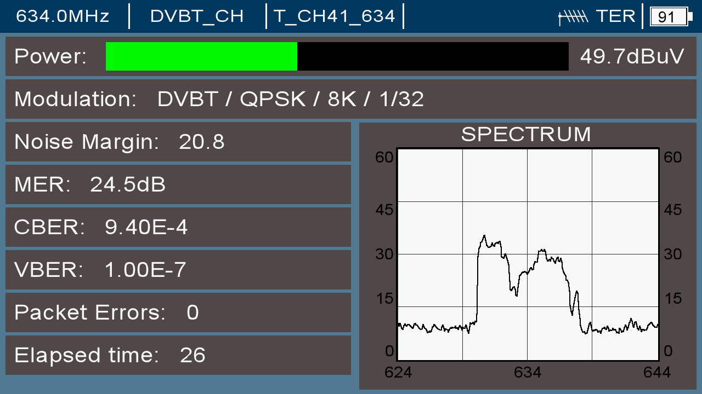
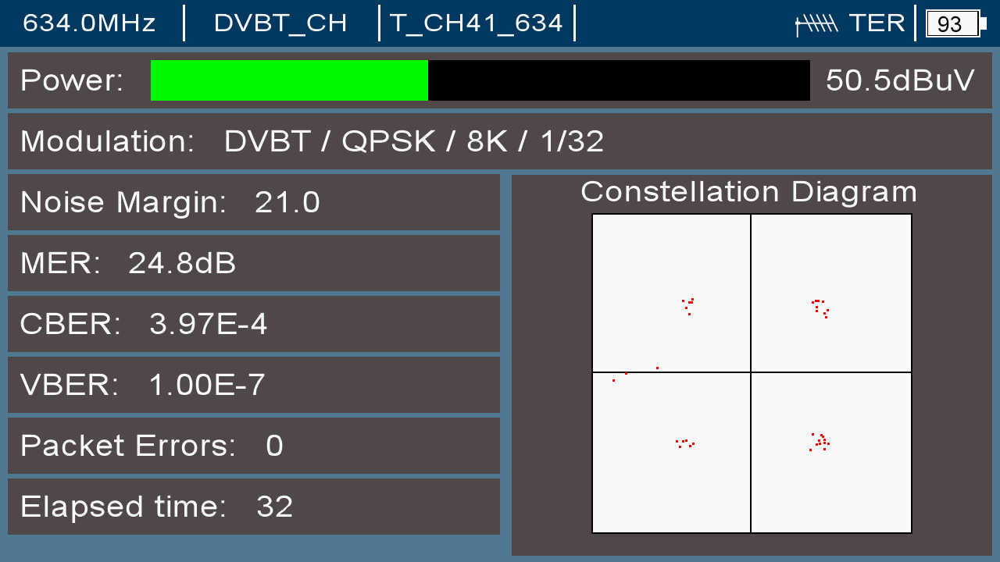
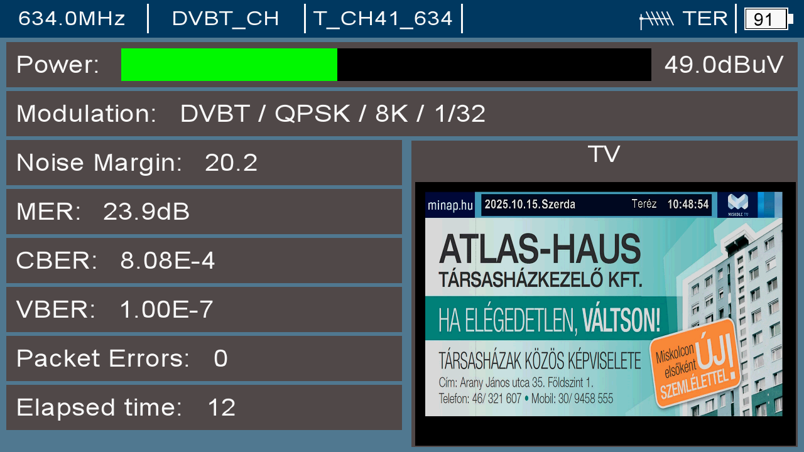

# DVB-T MÉRÉS ÉS JEGYZŐKÖNYV
### Mérés helye: Miskolci SZC Kandó Kálmán Informatikai Technikum
### Mérés időpontja: 2025.10.09.
### Mérő műszerek: Metek HDD
### Felelős személy: Kiss Gergely, Jakab Balázs
### Cél: A DVB-T jel minőségi paramétereinek mérése.
## 1. Beveztés
**A mérés célja a DVB-T jel paramétereinek ellenőrzése a földfelszíni digitális műsorszórás során. A mérési pont a V3 LABOR, ahol a DVB-T adások vételének minőségét mérjük.**
## 2. Mérési helyszín és környezet
- Koordináták: 48,1058990°N 20,7800436°E
- Antenna típusa: IKUSI FLASH HD 3
- Antenna magassága: 1.2 m
- Környezet jellemzői: V3 labor, városi körülmények között
- Adó távolsága: 799.56 mű
### Adó-Vevő távolság

## 3. Mérési paraméterek
| Paraméter | Érték |
|-----------|-----------|
| Adó frekvencia	| 634 MHz |
|Sávszélesség|	8MHz|
|Moduláció típusa|	DVBT, QPSK, 8K, 1/32|
|Jelerősség| (RSSI)	63.8 dBu|
|MER|	23.1 dB|
|Noise Margin|	19.2|
|Hiba nélkül vett adás időtartama|	400 sec|
### Miskolci TV torony által sugárzott frekvenciák

### CH45-ös csatornán mért spektrum

### A CH45 -ös csatornán mért jelerősség, jel/zaj viszony, és bithibák

### A CH45 -ös csatorna konstellációs diagramja

### A CH45 -ös csatornán a DUNATV HD jelszint és TV adás

### A CH45 -ös csatornán a DUNATV HD műsora

## 4. Mérési eredmények
- Jelerősség: A mért jelerősség 50 dBu. Ez az érték stabil volt 400 másodperces időtartam alatt, és megfelel a DVB-T előírásoknak. A mérési helyen a jel optimális volt. 

- Modulációs paraméterek: A DVBT moduláció esetén a mért jel/zaj viszony (SNR) 12 dB körül váltakozott, ami megfelel a követelményeknek.

- Modulation Error Ratio (MER): A mért MER érték 23.1 dB volt, amely azt mutatja, hogy a vétel probléma mentes volt.

## 5. Elemzés
>Az eredmények alapján a mérési helyen megfelelő minőségű DVB-T vétel biztosítható. A jelerősség és SNR értékek a megadott határértékek között mozogtak. A MER alacsony, és nem okozott észlelhető minőségromlást a vételben. A moduláció stabil volt, és nem voltak nagyobb interferenciák a mérések során.

## 6. Következtetések
>A mérési helyen a DVB-T jel stabil és megfelelő minőségű.
A rendszer modulációs és vételi paraméterei kielégítik a DVB-T előírásokat.
A jel/zaj viszony és a jelminőség értékei optimálisak voltak a földfelszíni sugárzás vételéhez.
## 7. Javaslatok
>Ha szükséges, meg kell vizsgálni az antennarendszer fejlesztésének lehetőségét, vagy további méréseket kell végezni különböző időjárási körülmények között, hogy hosszú távon is biztosított legyen a megfelelő minőségű vétel.
